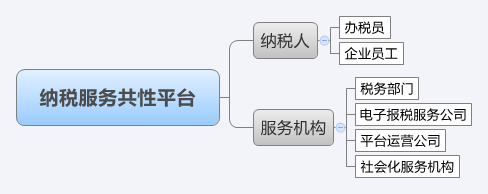

--------------------------------
1 丁税宝服务平台概述
--------------------------------

丁税宝服务共性平台是建立在钉钉平台上，通过移动互联网，在税务部门、税务软件技术服务公司以及纳税人之间建立的一个双向互动的实时消息沟通平台，该平台面向纳税人和税务部门工作者，功能完整、性能优异、用户体验良好。

目前纳税服务共性平台经过一期的建设，企业端已经能够满足在线咨询、离线咨询、通知公告定向推送、个税查询、涉税查询、涉税通知、留言板等一系列服务功能，进一步为纳税人提供涵盖业务和技术的网络化、多元化和社会化的服务。

+++++++++++++++++++++++++++++
1.1	平台简介
+++++++++++++++++++++++++++++

纳税服务平台由两部分组成，分别是即时沟通工具钉钉和纳税服务管理后台。

纳税服务共性平台旨在全社会共性服务资源为企业提供更好的财税服务，目前平台上的角色有两类，分别是纳税人和服务机构，其中服务机构分为四类分别是税务部门、电子报税技术服务、平台运营公司、社会化服务机构。如下图：

 
+++++++++++++++++++++++++++++ 
1.2	相关人员简介
+++++++++++++++++++++++++++++

税务部门：为纳税人提供办税服务，涉税服务。

电子报税服务公司：为纳税人解决使用报税软件过程中出现的问题。

平台运营公司：运营维护纳税服务共性平台。

社会化服务机构：为纳税人提供涉及财务、税务、法律、人力资源、管理等方面的咨询和服务。