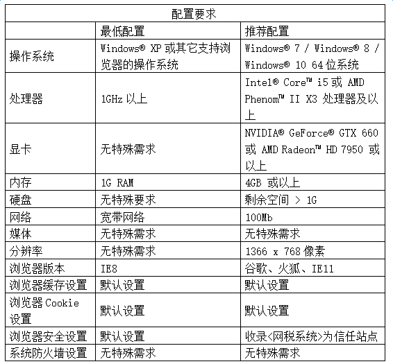

------------------------------------
2 丁税宝手机端部署
------------------------------------

管理员使用“丁税宝”，需要安装客户端软件“钉钉”，如下图：

+++++++++++++++++++++++++++++++++++++++++++ 
2.1	部署步骤
+++++++++++++++++++++++++++++++++++++++++++

方式一：微信扫面以下二维码，根据步骤填写手机号，验证码，团队的名称及姓名后即可创建团队并部署丁税宝。

方式二：手机应用市场下载“钉钉”，安装注册后创建团队并激活6人或以上，然后扫描以下二维码进行丁税宝部署。

.. image:: image/2.png
 :width: 180
 :height: 180
 