-------------------------------------
3 软件使用介绍（功能介绍） 
-------------------------------------

+++++++++++++++++++++++++++++++++++++++++++
3.1	登录系统
+++++++++++++++++++++++++++++++++++++++++++

===================
3.1.1 登录
===================

“杭州房产交易网上办税系统（纳税人端）”采用了浏览器作为系统客户端的使用工具，因此在客户端不需要再安装专用插件。用户登录步骤（图1-1）：

第一步：输入服务器地址。

第二步：选择用户登陆类型：中介机构用户登录和个人用户登录。

第三步：输入用户名和密码，登录。

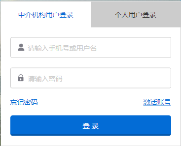

===================
3.1.2 首页
===================

系统首页分为：导航菜单，工作区菜单，最新消息和正在申报（图1-2）:

.. image:: image/home.png
 :width: 488
 :height: 194

+++++++++++++++++++++++++++++++++++++++++++
3.2	用户管理
+++++++++++++++++++++++++++++++++++++++++++

点击导航栏的设置进入用户管理页面（如图2-1）:

用户管理分为：账户设置，子账户设置和密码修改。

账户设置页面可以修改头像，手机，身份证，邮箱和固定电话等基本信息。（如图2-2）

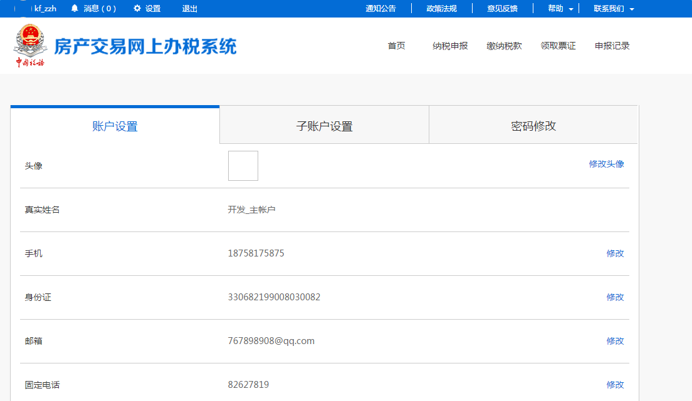

子账户设置页面可以新建，激活，暂停使用子账户。

+++++++++++++++++++++++++++++++++++++++++++
3.3 消息中心
+++++++++++++++++++++++++++++++++++++++++++

可以根据日期或受理单号等字段的组合查询受理单审核已完结和已结束意外的
消息:

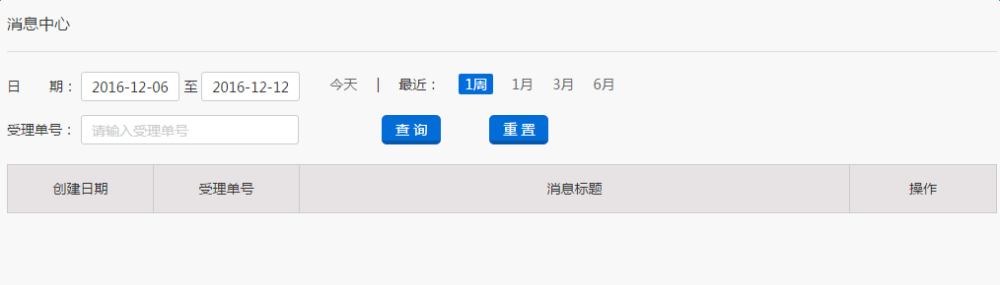

+++++++++++++++++++++++++++++++++++++++++++
3.4 纳税申报
+++++++++++++++++++++++++++++++++++++++++++

纳税申报步骤为：输入受理单编号->交易信息确认->税收减免申请->填写承诺书->申报材料上传->申报信息确认->核价结果确认

=====================
3.4.1 输入受理单编号
=====================

选择交易类型（二手房或商品房买卖），输入交易受理单编号，点击查询进入交易信息确认页面（图2-1）：

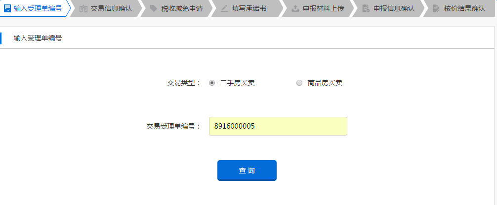

===================
3.4.2 交易信息确认
===================

勾选确认交易信息无误，点击确认进入税收减免申请页面（图2-2）：

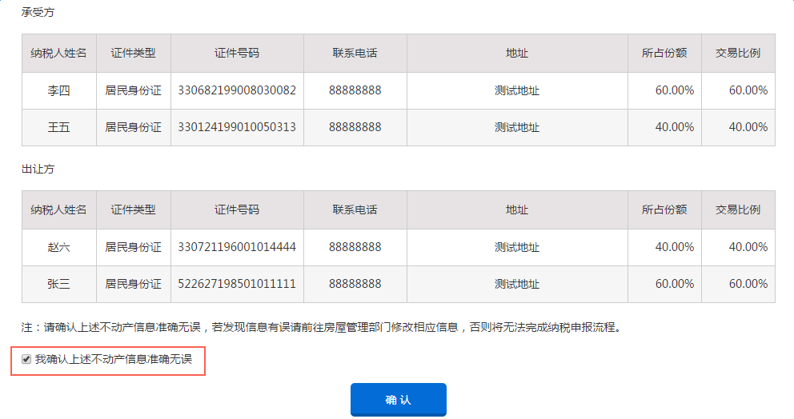

===================
3.4.3 税收减免申请
===================

分别选择契税（承受方），个税（出让方）和增值税（出让方）计税方式后点击确认进入下一个页面（图2-3）：

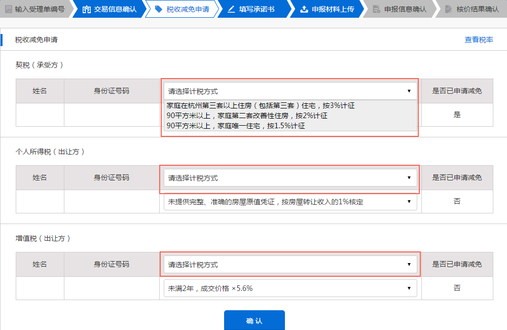

===================
3.4.4 填写承诺书
===================

点击添加按钮添加空行，在姓名一栏选择家庭成员，点击添加家庭按钮添加新家庭，勾选承诺后点击确认进入材料上传页面（图2-4）：

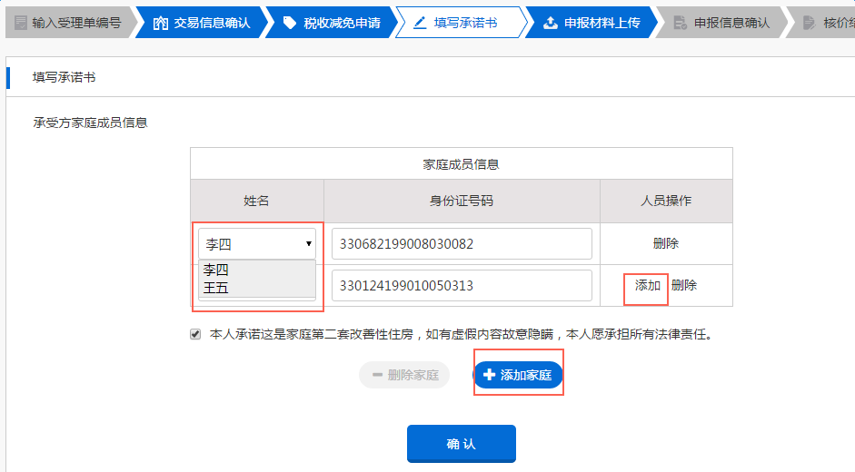

===================
3.4.5 申报材料上传
===================

点击左侧列表选择家庭，点击“+”按钮上传图片，图片上传后将图片拖拽至下侧相应位置，点击确认进入申报信息确认页面（图2-5）：

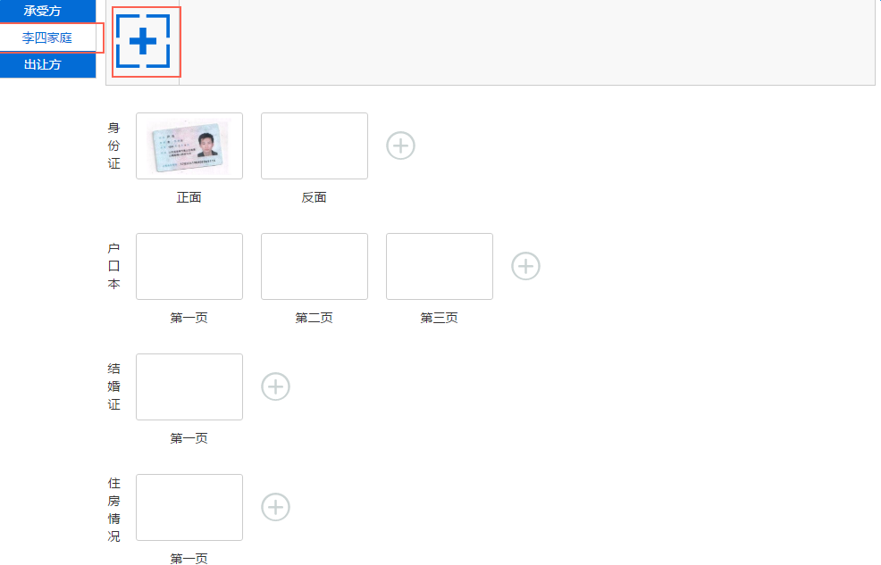

===================
3.4.6 核价结果确认
===================

申报信息审核通过后可在该页面查看核价结果。

===================
3.4.7 申报信息确认
===================

申报信息审核通过后可在该页面查看核价结果。

+++++++++++++++++++++++++++++++++++++++++++
3.5 缴纳税款
+++++++++++++++++++++++++++++++++++++++++++

纳税申报核价通过后，可进入缴纳税款页面缴税。

点击操作详情可以查看税款详情。

可通过网上银行或支付宝在线缴税，也可以选择去办税大厅或自助机缴税。

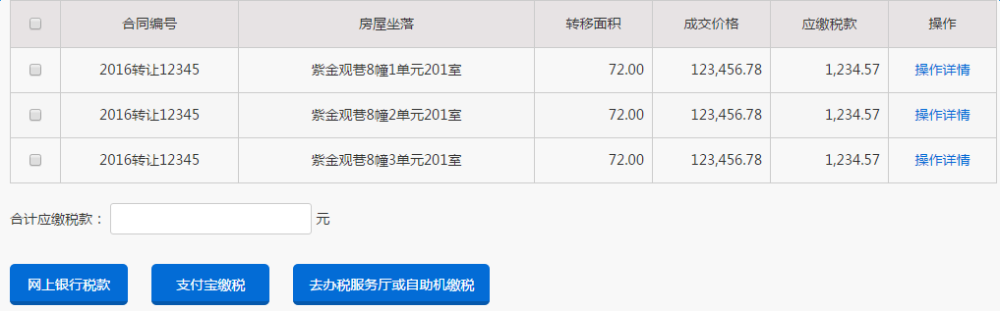

+++++++++++++++++++++++++++++++++++++++++++
3.6 领取票证
+++++++++++++++++++++++++++++++++++++++++++

缴纳税款后可进入领取票证页面在线下载电子发票和完税证明，或通过自助打印机打印或大厅领取纸质发票。

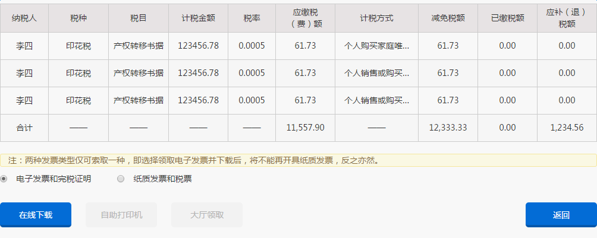

+++++++++++++++++++++++++++++++++++++++++++
3.7 申报记录
+++++++++++++++++++++++++++++++++++++++++++

申报记录页面可以通过申报人，申报日期，受理单号，房屋坐落，申报状态字段检索查询该账户纳税申报受理单。

可以查看受理单的申报信息，修改和删除状态为未提交的受理单。

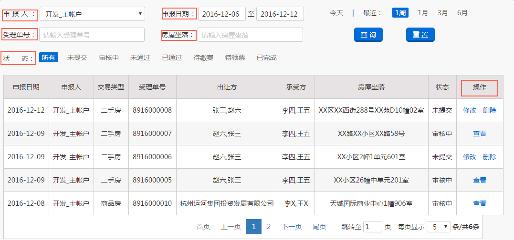