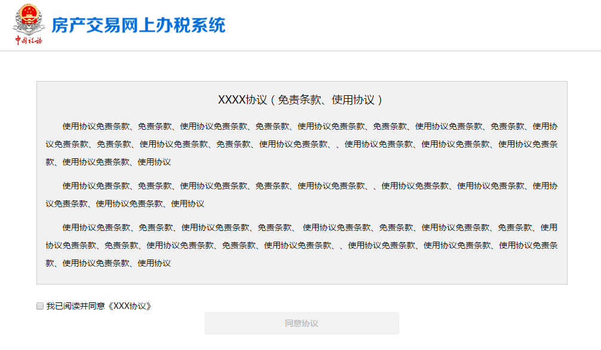
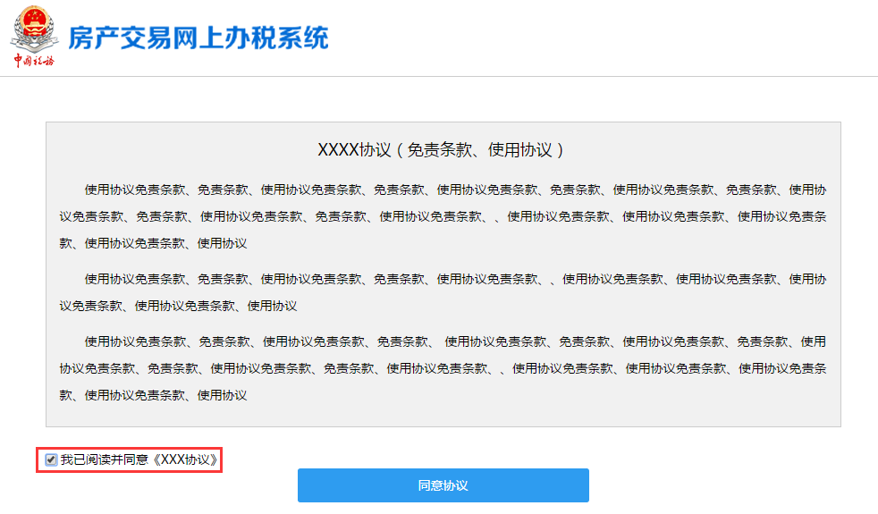
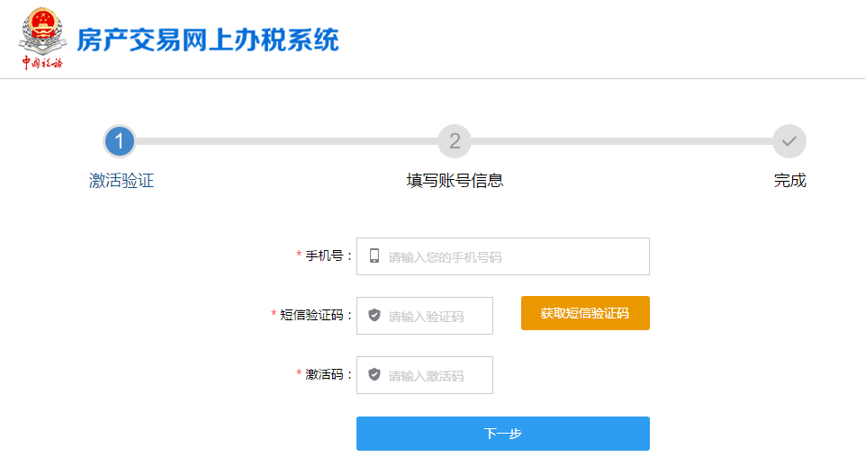
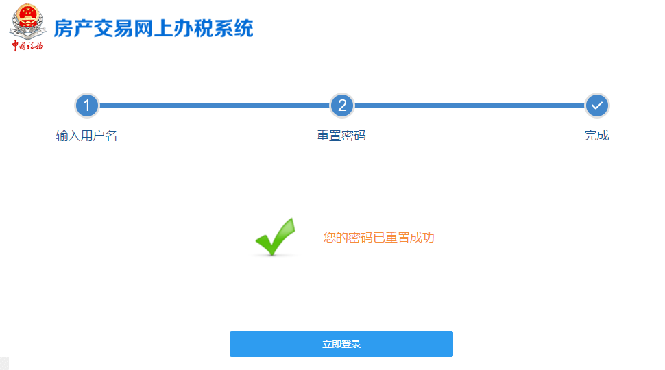

-------------------------------------
3 登录系统 
-------------------------------------

+++++++++++++++++++++++++++++++++++++++++++
3.1	登录
+++++++++++++++++++++++++++++++++++++++++++

“杭州房产交易网上办税系统（纳税人端）”采用了浏览器作为系统客户端的使用工具，因此在客户端不需要再安装专用插件。已有账号的用户登录步骤（如下图）： 

输入服务器地址；选择用户登陆类型：中介机构用户登录；输入用户名或手机号码和密码，点击【登录】。

+++++++++++++++++++++++++++++++++++++++++++
3.2	激活账号
+++++++++++++++++++++++++++++++++++++++++++

如果你的账号未进行激活，则可点击登录框上的的【激活账号】字样后进行激活。点击登录框上的的【激活账号】进入以下页面（如下图）：

阅读并勾选同意免责条款和使用协议后（如下图）进入账号激活页面。

输入手机号，点击【获取短信验证码】，输入收到的短信验证码和激活码（如下图），点击【下一步】。

填写账号信息，带*号的为必填项，不带*的为选填（如下图）。

点击【下一步】，完成激活（如下图）。点击【立即登录】，即可返回登录页。

+++++++++++++++++++++++++++++++++++++++++++
3.3.忘记密码
+++++++++++++++++++++++++++++++++++++++++++

如果你忘记了你的登录密码，可点击登录框上的【忘记密码】字样进行密码取回。点击登录页的【忘记密码】后进入重置密码页面（如下图）：

输入用户名和图片验证码，点击【提交】。

点击【获取短信验证码】，输入收到的短信验证码，设置新密码（如下图）。

点击【提交】，完成密码重置（如下图）。点击【立即登录】，即可返回登录页。

+++++++++++++++++++++++++++++++++++++++++++
3.4.退出系统
+++++++++++++++++++++++++++++++++++++++++++

点击顶部菜单的【退出】按钮即可退出系统：

