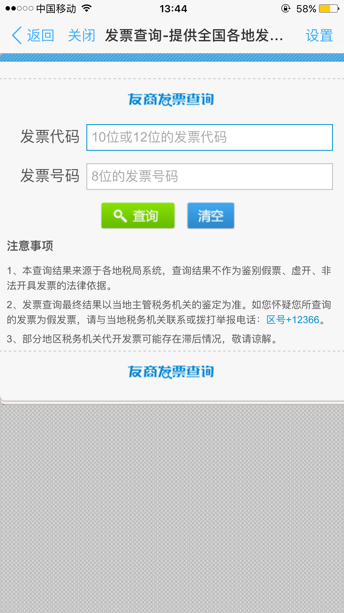
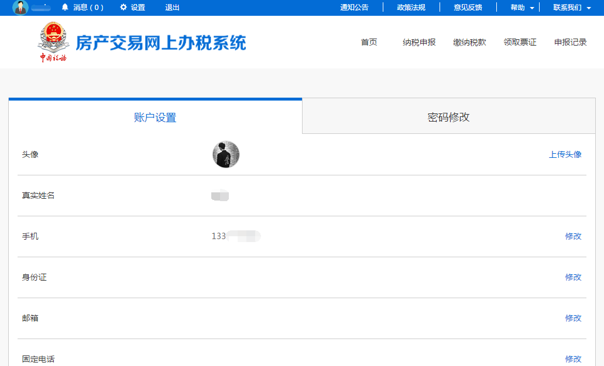

---------------------------
4 发票查询
---------------------------

+++++++++++++++++++++++++++++++++++++++++++
4.1	发票查询简介
+++++++++++++++++++++++++++++++++++++++++++

发票查询目前提供浙江地税发票真伪查询功能，输入发票代号、号码即可在移动端检验发票真伪。

+++++++++++++++++++++++++++++++++++++++++++
4.2	发票真伪的查询
+++++++++++++++++++++++++++++++++++++++++++

点击“发票查询”可以进入检验发票真伪的界面，如下图：

 
在发票查询界面输入发票代码、发票号码两个内容后，选择发票类型、填写纳税人识别号、验证码点击查询即可检验发票的真伪。
