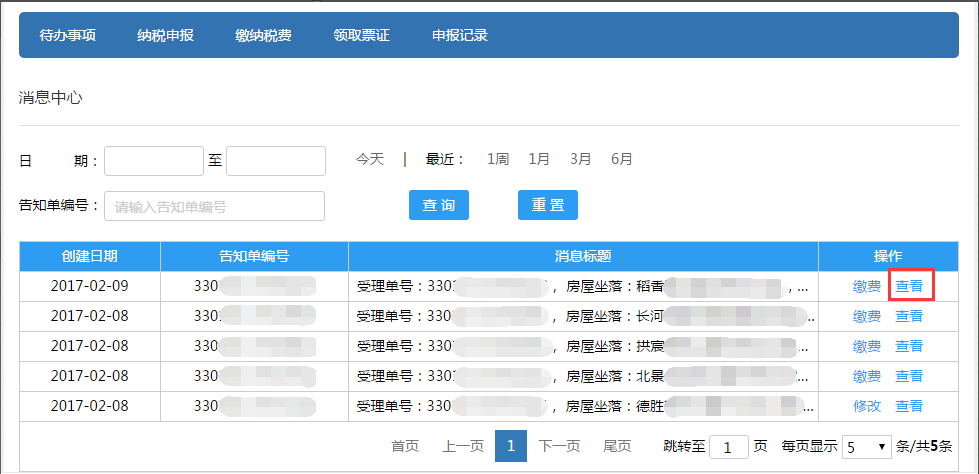

---------------------------
4 系统首页
---------------------------

+++++++++++++++++++++++++++++++++++++++++++
4.1	首页
+++++++++++++++++++++++++++++++++++++++++++

用户登录系统后，所看到的主界面如下图所示。注：当用户处在其他界面（已登录系统，且无操作未超过30分钟）时，点击【首页】按钮，也可回到网站首页。

首页菜单栏分为三大模块：导航栏，辅助导航栏和工作区域。

导航栏列出了所有的功能模块，包括首页、纳税申报、缴纳税款、领取票证和申报记录。

辅助导航栏列出了辅助功能模块：包括用户管理、消息中心、通知公告、政策法规、意见反馈、帮助和联系我们。

工作区域包括最新消息和正在申报。

.. image:: image/1.png
 :width: 488
 :height: 150

+++++++++++++++++++++++++++++++++++++++++++
4.1	用户管理
+++++++++++++++++++++++++++++++++++++++++++

点击顶部菜单的【设置】或【用户名】进入用户管理页面（如下图）：

账户类型分为主账户和子账户。主账户的用户管理包括账户设置，子账户设置和密码修改（如下图）。

.. image:: image/3.png
 :width: 488
 :height: 150

子账户的用户管理包括账户设置和密码修改（如下图）。

.. image:: image/4.png
 :width: 488
 :height: 150

=========================
4.2.1.账户设置
=========================

账户设置页面可以修改头像、手机、身份证、邮箱和固定电话等基本信息。
手机号信息修改：点击【手机】信息栏右侧的【修改】，弹出手机号码修改界面，输入原手机号码，点击【获取短信验证码】，输入手机获取到的短信验证码，点击【下一步】。

.. image:: image/5.png
 :width: 488
 :height: 150

输入新手机号码，点击【获取短信验证码】，输入手机获取到的短信验证码，点击【完成】（如下图）。

身份证信息修改：点击【身份证】信息栏右侧的【修改】，弹出身份证号码修改界面（如下图），输入身份证号码，点击【修改】，即可修改身份证号码；点击【取消】，返回账户设置界面。  

.. image:: image/7.png
 :width: 488
 :height: 150 

（注：邮箱、固定电话的修改步骤参照身份证号码的修改）

=========================
4.2.2.子账户设置
=========================

子账户设置页面包括新建、暂停使用、恢复使用、注销和删除子账户功能（如下图）。

.. image:: image/8.png
 :width: 488
 :height: 150

注：未激活的子账户可以删除，已激活的子账户只能暂停使用或注销。

点击【新建子账户】，弹出新建子账户界面（如下图），输入姓名（必须为汉字或字母）和手机号，点击【创建】，即可新建子账户。

.. image:: image/9.png
 :width: 488
 :height: 150

点击【暂停使用】，弹出提示，点击【确认】（如下图），即可暂停使用该子账户。

点击【恢复使用】，弹出提示，点击【确认】（如下图），即可恢复使用该子账户。

点击【注销】，弹出提示，点击【确认】（如下图），即可注销该子账户。

点击【删除】，弹出提示，点击【确认】（如下图），即可删除该子账户。

=========================
 4.2.3.密码修改
=========================

输入原密码、新密码（密码需由6-16个字母、数字和符号组成，区分大小写），点击【保存】（如下图），即可修改密码。

输入原密码和新密码，点击【重置】（如下图），即可清空所填内容。

.. image:: image/15.png
 :width: 488
 :height: 150

=========================
4.3.消息中心
=========================

点击顶部菜单的【消息】进入消息中心页面（如下图）：

消息中心页面可以通过【日期】和【受理单号】查询该账户所有受理单的消息（如下图）。点击【今天】【1周】【1月】【3月】【6月】日期会自动填写。
点击【重置】可以清空查询条件。

点击操作栏的【查看】（如下图）：

进入消息详情页（如下图）：

点击操作栏的【缴款】（如下图），进入缴纳税款页面。点击操作栏的【确认】（如下图），进入申报信息确认页面。

============================
4.4.最新消息（同消息中心）
============================

在首页中的最新消息可以查看受理单已确认提交和已审核完成等消息（如下图）,操作同消息中心。点击【查看更多】可进入消息中心页面查看所有消息。

============================
4.5.正在申报（同申报记录）
============================

在首页中可以查看正在申报的受理单（如下图），【查看】，【修改】和【删除】按钮同申报记录。点击【查看更多】可进入申报记录页面查看所有申报记录。

 

