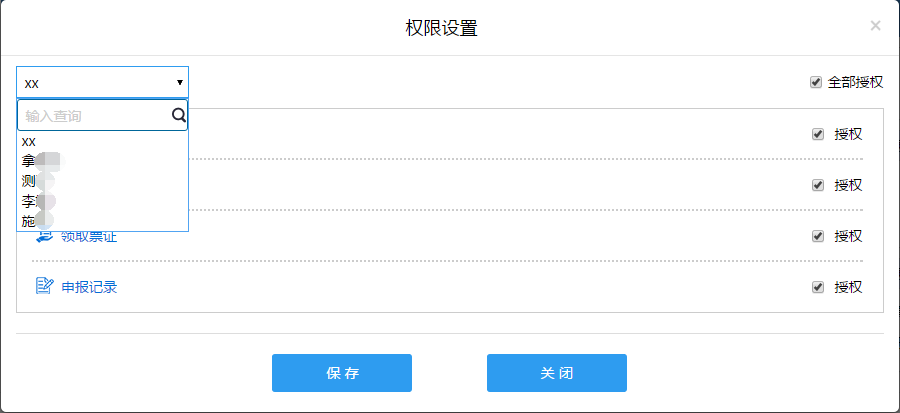
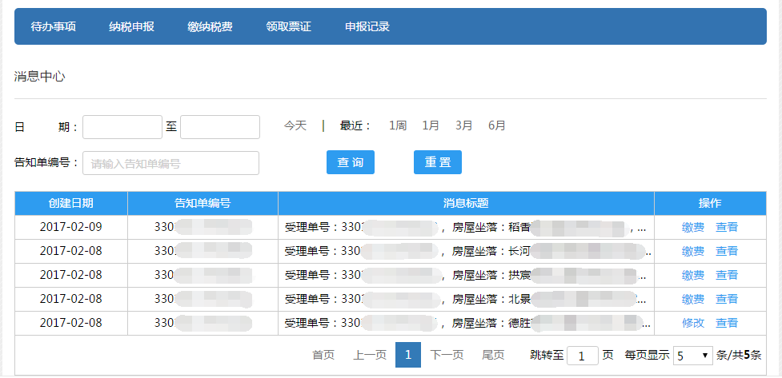

---------------------------
4 系统首页
---------------------------

+++++++++++++++++++++++++++++++++++++++++++
4.1	首页
+++++++++++++++++++++++++++++++++++++++++++

首页菜单栏分为两大模块：导航栏和工作区域（如下图）。

导航栏列出了所有的功能模块，包括待办事项、纳税申报、缴纳税费、领取票证和申报记录。

工作区域包括最新消息和正在申报。

注：当用户处在其他界面（已登录系统，且无操作未超过30分钟）时，点击【待办事项】按钮，也可回到网站首页。

+++++++++++++++++++++++++++++++++++++++++++
4.2	权限设置
+++++++++++++++++++++++++++++++++++++++++++

点击【操作员名称】后的蓝色字体，进入权限设置界面（如下图）。

.. image:: image/2.png
 :width: 700
 :height: 150

在左上方下拉菜单中可选择或输入查询子账户，勾选该子账户下各个模块的权限，也可以勾选右上方【全部授权】进行一键授权（如下图），点击【保存】即可完成权限设置。

+++++++++++++++++++++++++++++++++++++++++++
4.3.最新消息
+++++++++++++++++++++++++++++++++++++++++++

点击【最新消息】的【更多】进入消息中心界面（如下图）。

.. image:: image/4.png
 :width: 700
 :height: 150

消息中心界面可以通过【日期】和【告知单编号】查询该账户所有受理单的消息（如下图）。点击【今天】、【1周】、【1月】、【3月】、【6月】，日期会根据当前日期自动填写。

点击【重置】可以清空查询条件。

点击操作栏的【查看】（如下图）：

.. image:: image/6.png
 :width: 700
 :height: 150

进入消息详情页（如下图）：

分别点击操作栏的【缴费】、【修改】、【确认】（如下图），分别进入【缴纳税费】界面、上一次申报的界面、【申报信息确认】界面。

+++++++++++++++++++++++++++++++++++++++++++
4.4.正在申报
+++++++++++++++++++++++++++++++++++++++++++

在首页中可以查看正在申报的受理单（如下图），【查看】、【修改】、【领票】、【删除】等功能同申报记录。点击【更多】可进入【申报记录】界面查看所有申报记录。

.. image:: image/9.png
 :width: 700
 :height: 150
 

