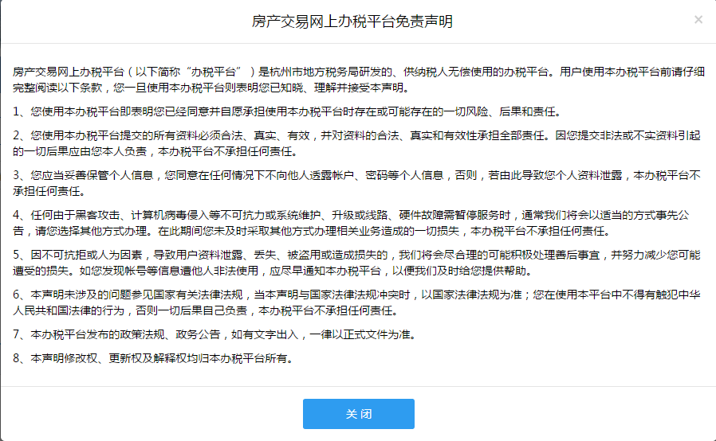
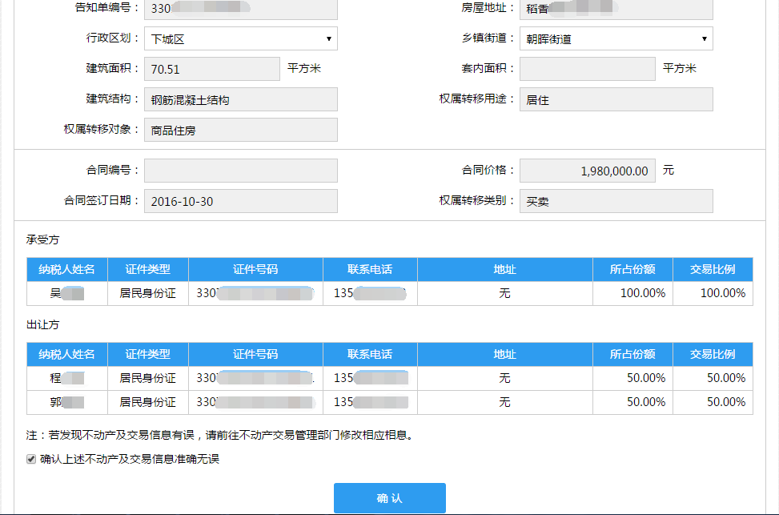
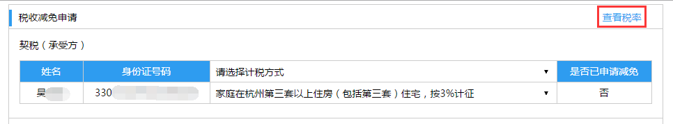
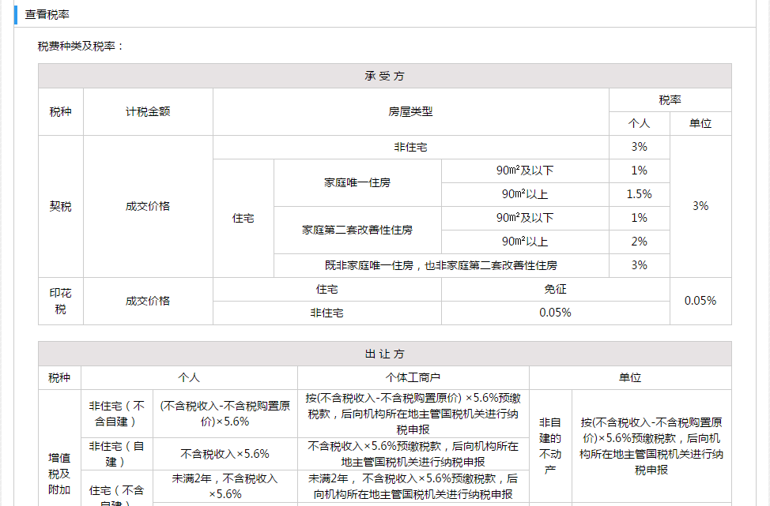
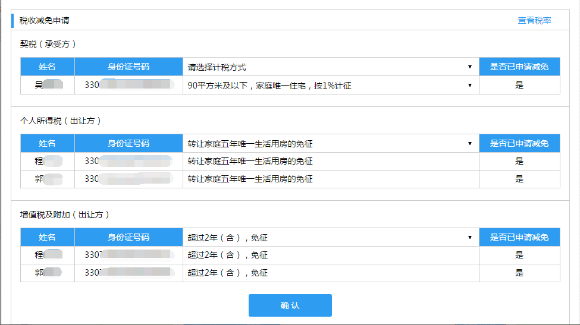

---------------------------
5.纳税申报
---------------------------

纳税申报步骤为：输入告知单编号→交易信息确认→税收减免申请→填写承诺书→申报材料上传→申报信息确认→申报税费确认。

+++++++++++++++++++++++++++++++++++++++++++
5.1.输入受理单编号
+++++++++++++++++++++++++++++++++++++++++++

选择交易类型（二手房或商品房买卖），输入告知单编号，可点击“《免责声明》”查看免责声明具体内容，勾选【我已阅读并同意 《免责声明》】（如下图），点击【查询】进入【交易信息确认】界面。

.. image:: image/1.png
 :width: 700
 :height: 150

输入告知单编号，如输入格式不对，将出现提示信息（如下图）。

.. image:: image/3.png
 :width: 700
 :height: 150

输入告知单编号，如输入的告知单已进行申报，将出现提示信息（如下图）。

.. image:: image/4.png
 :width: 700
 :height: 150

+++++++++++++++++++++++++++++++++++++++++++
5.2.交易信息确认
+++++++++++++++++++++++++++++++++++++++++++

用户查看交易信息并核对，勾选“确认上述不动产及交易信息准确无误”后（如下图），点击【确认】进入【税收减免申请】界面。（注：可选项未填写的需要正确填写）

+++++++++++++++++++++++++++++++++++++++++++
5.3.税收减免申请
+++++++++++++++++++++++++++++++++++++++++++

点击右上方【查看税率】进入界面，查看具体税率（如下图）。

分别选择契税（承受方），个税（出让方）和增值税（出让方）计税方式后，点击【确认】进入【填写承诺书】界面（如下图）。

注：当契税（承受方）和个人所得税（出让方）【是否已申请减免】都为【否】时（如下图），点击【确认】进入【申报信息确认】界面。

+++++++++++++++++++++++++++++++++++++++++++
5.4.填写承诺书
+++++++++++++++++++++++++++++++++++++++++++

点击【添加】按钮添加空行（如下图）。

点击【删除】按钮可删除多余行（如下图）。

.. image:: image/11.png
 :width: 700
 :height: 150

同理，点击【添加家庭】按钮可添加新家庭（如下图），点击【删除家庭】按钮可删除多余的家庭。

.. image:: image/12.png
 :width: 700
 :height: 150

注：当承受方或出让方下拉菜单中只有一个人，这方最多只有一个家庭，承受方或出让方家庭个数不能超过一个（如下图）。

确认家庭成员信息正确，勾选承诺后，点击【确认】进入【申报材料上传】界面。

+++++++++++++++++++++++++++++++++++++++++++
5.5.申报材料上传
+++++++++++++++++++++++++++++++++++++++++++

点击左侧列表选择家庭，点击左侧【+】按钮可批量从电脑端上传图片，图片上传后将图片拖拽至下侧相应位置（如下图），系统会自动进行OCR扫描识别，识别成功后照片右上角会出现“√”号，鼠标移到“√”上可查看OCR识别出的信息。

点击【上传】进入【申报信息确认】界面。（注：每种类型的图片至少有一张，即可上传）

+++++++++++++++++++++++++++++++++++++++++++
5.6.申报信息确认
+++++++++++++++++++++++++++++++++++++++++++

勾选核对信息无误后（如下图），点击【提交审核】，即确认提交申报信息，耐心等待审核结果。

+++++++++++++++++++++++++++++++++++++++++++
5.7.申报税费确认
+++++++++++++++++++++++++++++++++++++++++++

申报信息审核通过后可在该界面查看申报税费结果。

找到【最新消息】或【消息中心】或【申报记录】中的那条相关申报记录，点击操作栏的【确认】（如下图）进入【申报税费确认】界面。
 

查看税费结果，勾选声明后，点击【确认申报】，进入【缴纳税款】环节。

 