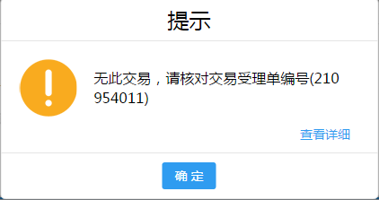
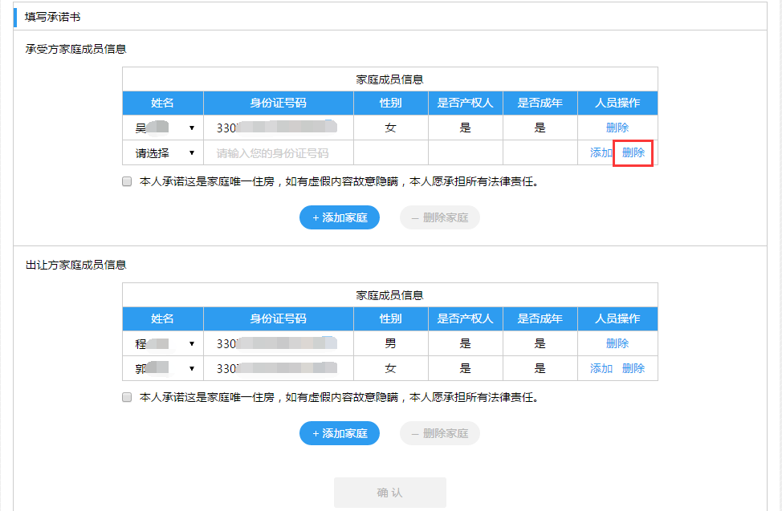
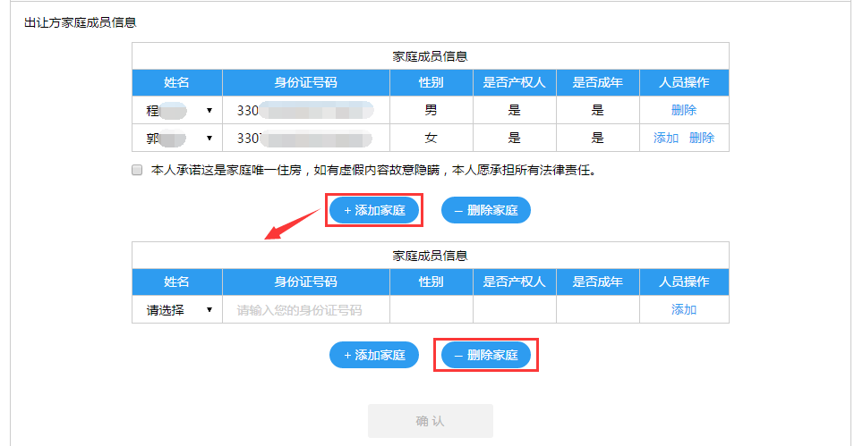

---------------------------
5.纳税申报
---------------------------

纳税申报步骤为：输入受理单编号->交易信息确认->税收减免申请->填写承诺书->申报材料上传->申报信息确认->核价结果确认

+++++++++++++++++++++++++++++++++++++++++++
5.1.输入受理单编号
+++++++++++++++++++++++++++++++++++++++++++

选择交易类型（二手房或商品房买卖），输入交易受理单编号，点击【查询】进入【交易信息确认】页面。

注：若交易类型为存量房，则输入房管受理单编号（受理单后8位编号,纳税人可查看范例,如输入格式不对，将出现提示信息）。

+++++++++++++++++++++++++++++++++++++++++++
5.2.交易信息确认
+++++++++++++++++++++++++++++++++++++++++++

用户查看交易信息并核对，勾选确认交易信息无误后，点击【确认】进入【税收减免申请】页面：

.. image:: image/2.png
 :width: 488
 :height: 150

+++++++++++++++++++++++++++++++++++++++++++
5.3.税收减免申请
+++++++++++++++++++++++++++++++++++++++++++

进入税收减免申请页面后，点击右上方【查看税率】进入界面，查看具体税率（如下图）。

分别选择契税（承受方），个税（出让方）和增值税（出让方）计税方式后，点击【确认】进入【填写承诺书】页面（如下图）。

.. image:: image/5.png
 :width: 488
 :height: 150

注：当契税（承受方）和个人所得税（出让方）【是否已申请减免】都为【否】时（如下图），点击【确认】进入【申报信息确认】界面。

.. image:: image/6.png
 :width: 488
 :height: 150

+++++++++++++++++++++++++++++++++++++++++++
5.4.填写承诺书
+++++++++++++++++++++++++++++++++++++++++++

点击【添加】按钮添加空行（如下图）。

.. image:: image/7.png
 :width: 488
 :height: 150

点击【删除】按钮可删除多余空行（如下图）。

.. image:: image/8.png
 :width: 488
 :height: 150

同理，点击【添加家庭】按钮可添加新家庭（如下图），点击【删除家庭】按钮可删除多余的家庭。

.. image:: image/9.png
 :width: 488
 :height: 150

在姓名一栏选择家庭成员，身份证号码会自动匹配，勾选承诺后点击【确认】后进入【申报材料上传】页面（如下图）：

.. image:: image/10.png
 :width: 488
 :height: 150

+++++++++++++++++++++++++++++++++++++++++++
5.5.申报材料上传
+++++++++++++++++++++++++++++++++++++++++++

点击左侧列表选择家庭，点击左侧【+】按钮可批量从电脑端上传图片，图片上传后将图片拖拽至下侧相应位置（如下图），系统会自动进行OCR扫描识别，识别成功后照片右上角会出现“√”号，鼠标移上去可查看OCR识别出的信息。点击【上传】进入【申报信息确认】页面。（注：每种类型的图片至少有一张即可上传）

+++++++++++++++++++++++++++++++++++++++++++
5.6.申报信息确认
+++++++++++++++++++++++++++++++++++++++++++

勾选核对信息无误后（如下图），点击【提交审核】，即确认提交申报信息，耐心等待审核结果。

+++++++++++++++++++++++++++++++++++++++++++
5.7.核价结果确认
+++++++++++++++++++++++++++++++++++++++++++

申报信息审核通过后可在该页面查看核价结果。
 

