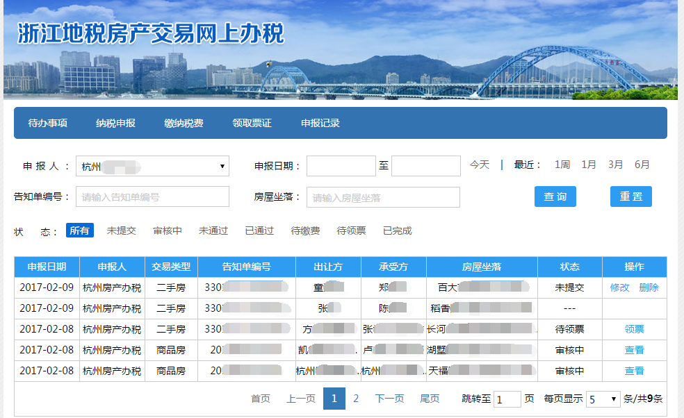
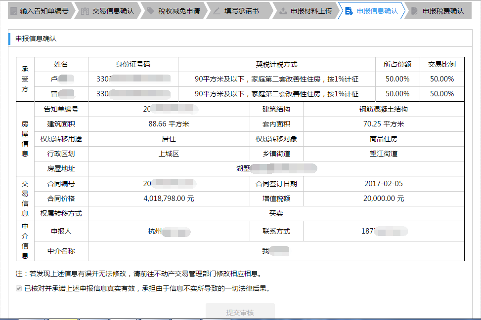
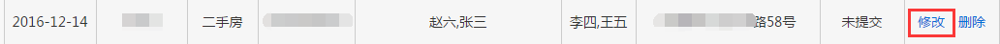
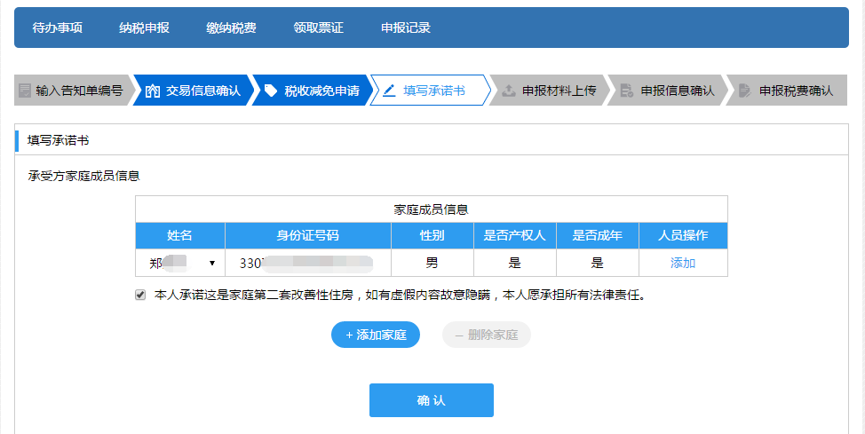
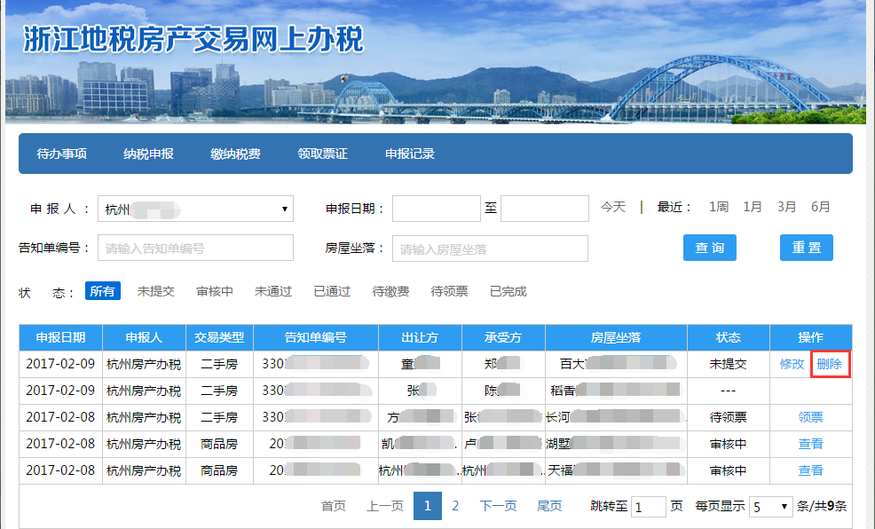

--------------------------------
8 申报记录
--------------------------------

点击导航栏的【申报记录】进入【申报记录】界面（如下图）。

.. image:: image/1.png
 :width: 700
 :height: 150

【申报记录】界面可以通过【申报人】、【申报日期】、【告知单编号】、【房屋坐落】、【状态】查询该账户纳税申报受理单。

点击【今天】、【1周】、【1月】、【3月】、【6月】申报日期会根据当前日期自动填写。

点击【重置】可以清空查询条件。（如下图）

状态为【审核中】的受理单可以查看受理单申报信息，点击操作栏中的【查看】（如下图）。

.. image:: image/3.png
 :width: 700
 :height: 150

进入【申报信息确认】界面查看（如下图）。

状态为【未提交】的受理单可以修改和删除，点击操作栏中的【修改】（如下图）。

进入上次已确认的申报界面修改申报信息（如下图）。

点击操作栏中的【删除】（如下图），删除该申报受理单。

 

