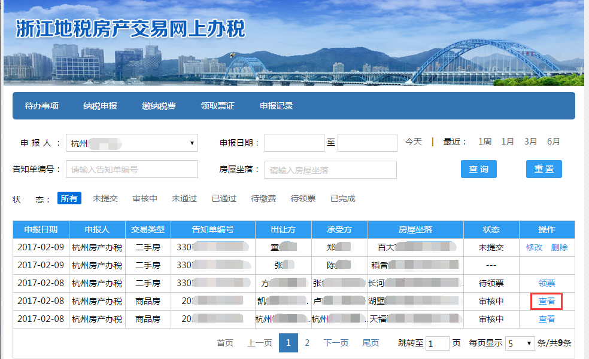
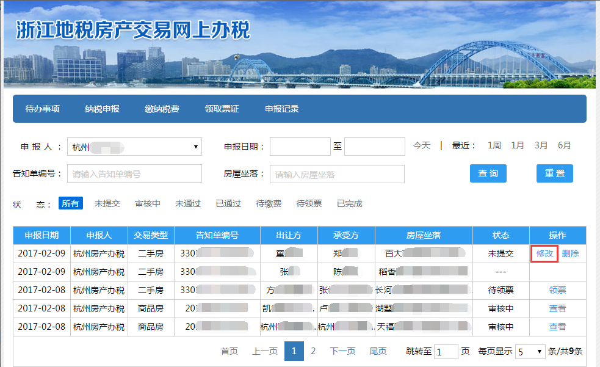

--------------------------------
8 申报记录
--------------------------------

点击导航栏的申报记录进入申报记录页面（如下图）。

申报记录页面可以通过【申报人】，【申报日期】，【受理单号】，【房屋坐落】，【申报状态】查询该账户纳税申报受理单。
点击【今天】【1周】【1月】【3月】【6月】申报日期会自动填写。点击【重置】可以清空查询条件（如下图）。

状态为审核中的受理单可以查看受理单申报信息，点击操作栏中的【查看】（如下图）：

进入申报信息确认页面查看（如下图）：

状态为未提交的受理单可以修改和删除，点击操作栏中的【修改】（如下图）：

进入上次已确认的申报页面修改申报信息（如下图）：

点击操作栏中的【删除】（如下图），删除该申报受理单。

 

